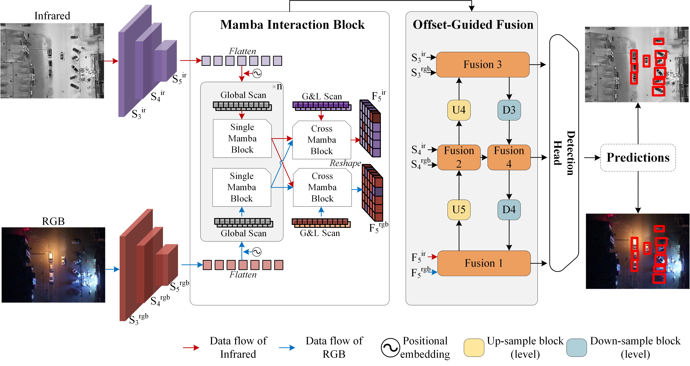

# COMO: CrOss-Mamba Interaction and Offset-Guided Fusion for Multimodal Object Detection

## 📖 Introduction
This repository contains the official implementation of **COMO**, a framework designed to improve multimodal object detection through **CrOss-Mamba interaction** and **Offset-guided fusion**.  
Our approach mitigates offset effects, reduces computational costs, and improves the accuracy of multimodal object detection in remote sensing scenarios.

<p align="center">
  
</p>

---

## 🛠 Requirements

- **Python**: 3.11  
- **PyTorch**: 2.0.0
- **Numpy**: 1.23.5
- **CUDA**: 11.8~12.5

- Other requirements can be seen in requirement.txt   

Install dependencies step by step:

```bash
# 1. Install dependencies
pip install causal_conv1d-1.1.1+cu118torch2.0cxx11abiFALSE-cp311-cp311-linux_x86_64.whl
pip install mamba_ssm-1.2.0.post1+cu118torch2.0cxx11abiFALSE-cp311-cp311-linux_x86_64.whl
# mamba_ssm-1.2.0链接: https://pan.baidu.com/s/16X_vhdSkRB_9y6GKOgv4cw?pwd=1234 提取码: 1234

# 2. Replace mamba_simple.py & local_scan.py
# (copy modified ./ssm/mamba_simple.py and ./ssm/local_scan.py  into the installed mamba-ssm package folder as fig.1 )

# 3. Replace selective_scan_interface.py 
# (copy  modified ./ssm/selective_scan_interface.py into the correct path in mamba-ssm/ops)

mamba-ssm/
├── modules/
│   ├── mamba_simple.py     ← Replace this file (Step 2)
│   └──  local_scan.py       ← Replace this file (Step 2)
├── ops/
│   └── selective_scan_interface.py ← Replace this file (Step 3)
````

---

## 📊  dataset
The DroneVehicle dataset is available through Baidu Cloud:

🔗 Download Link: [Baidu Cloud Drive](https://pan.baidu.com/s/1V4A8cqIOd2-srhixmzo6Rg?pwd=1234)  \
📁 Extraction Code: 1234\
📦 File Size: 6.46 GB \
📄 Format: ZIP archive

🏗 Dataset Structure
After downloading and extracting, organize the dataset as follows:

```code
DroneVehicle/
├── visible/
│   ├── train/
│   │   ├── 00001.jpg
│   │   ├── 00002.jpg
│   │   └── ...
│   ├── val/
│   │   └── ...
│   └── test/
│       └── ...
├── infrared/
│   ├── train/
│   │   └── ...
│   ├── val/
│   │   └── ...
│   └── test/
│       └── ...
└── labels/
    ├── train/
    │   └── ...
    ├── val/
    │   └── ...
    └── test/
       └── ...

```

## 🚀 Train

To train COMO on your dataset, run:

```bash
torchrun --nproc_per_node=2 --master_port=29502 train.py 
```

> ⚠️ Adjust dataset path and hyperparameters according to your environment.

---

## 🧪 Validation

To evaluate a trained model, and the checkpoint is in './checkpoint/best.pt':

```bash
python val.py 
```

This will output precision, recall, and mAP results.

---

## 🧪 Compute param. and Flops

```bash
python param.py 
```

This will output param. and Flops.

---

## 🧪 Prediction

```bash
python  predict_write_csv.py
```

This will output predictions.

---

## 🙏 Acknowledgements

This repository is built upon [Ultralytics YOLO](https://github.com/ultralytics/ultralytics) and [mamba-ssm](https://github.com/state-spaces/mamba).
We thank the authors for their excellent work.

---

## 📑 Citation

If you find this repository useful, please cite our paper:

```bibtex
@article{liu2026cross,
  title={COMO: Cross-mamba interaction and offset-guided fusion for multimodal object detection},
  author={Liu, Chang and Ma, Xin and Yang, Xiaochen and Zhang, Yuxiang and Dong, Yanni},
  journal={Information Fusion},
  volume={125},
  pages={103414},
  year={2026},
  publisher={Elsevier}
}
```

---

## 📧 Contact

For questions or discussions, please contact **[liu_chang_@whu.edu.cn](liu_chang_@whu.edu.cn)**.

